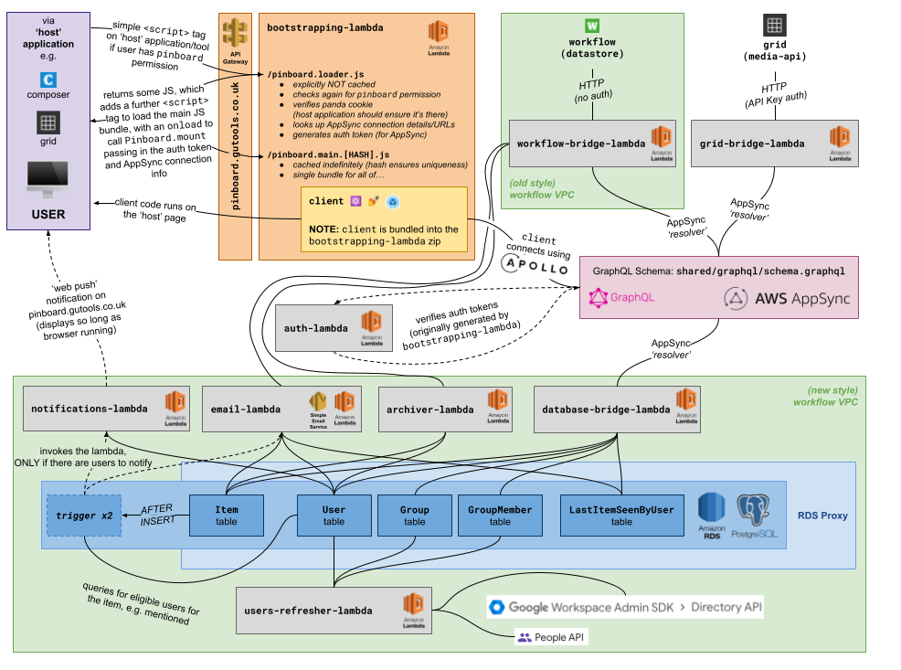

# PinBoard 📌

```
A Guardian discussion and asset sharing app for editorial story development, integrated with our key editorial tools such as Composer (news stories) and the Grid (images).
```

This project is written pretty much exclusively in TypeScript (both frontend & backend) and is entirely serverless (server side is a set of lambdas plus [AWS AppSync](https://aws.amazon.com/appsync/)) except the database which is an RDS Postgres instance.

We use [yarn workspaces](https://classic.yarnpkg.com/en/docs/workspaces/) to break up the project into different sub-projects...

- [`bootstrapping-lambda`](bootstrapping-lambda)
- [`client`](client)
- [`auth-lambda`](auth-lambda)
- [`notifications-lambda`](notifications-lambda)
- [`users-refresher-lambda`](users-refresher-lambda)
- [`workflow-bridge-lambda`](workflow-bridge-lambda)
- [`database-bridge-lambda`](database-bridge-lambda)
- [`grid-bridge-lambda`](grid-bridge-lambda)
- [`archiver-lambda`](archiver-lambda)
- [`email-lambda`](email-lambda)
- [`cdk`](cdk)

... PLUS a [`shared`](shared) directory for sharing constants and logic between the other sub-projects.

There's also a shared top level `tsconfig.json` (which is then [extended](https://www.typescriptlang.org/tsconfig#extends) in the sub-project, e.g. to configure react in the `client` sub-project).

To avoid the burden of maintaining lots of dependencies across all the different tools, PinBoard takes a different approach, where we add a `<script` tag to the various tools ([e.g. in composer](https://github.com/guardian/flexible-content/blame/f9d37a49b0690a67952d2ccccf5255ab3dd7a3a6/flexible-content-composer-backend/src/main/webapp/WEB-INF/scalate-admin/composer.ssp#L106-L108)), which hits the [`bootstrapping-lambda`](bootstrapping-lambda) on the `/pinboard.loader.js` endpoint (which is explicitly NOT cached) which performs some auth checks before returning some javascript code - this approach facilitates super-fast deploys (when compared to a browser extension or releasing libraries then having to release all the host platforms with library bump).

**To see how all this fits together see the [Architecture Diagram](#architecture-diagram).**

## Running locally

### First-time set-up

Run `./scripts/setup.sh`, which...

- configures dev-nginx (according to `dev-nginx.yaml`)
- ensures all dependencies are installed

### Each time

- Ensure you have the latest AWS credentials (profile: `workflow`)
- Run `./scripts/start.sh`
- To check it's up, hit https://pinboard.local.dev-gutools.co.uk (to see the PinBoard floaty etc. on a blank page - having gone through the auth and permission checks - if you don't see anything take a look at the console in the browser)
- If the page doesn't seem to be working, and there is a [panda](https://github.com/guardian/pan-domain-authentication)-related error in the console, you may need to run and open another tool locally (like [Composer](https://github.com/guardian/flexible-content/pull/4077/files)) in order to generate the required auth cookies

NOTE: locally it uses the CODE AppSync API instance (since AppSync is a paid feature of localstack)

## Architecture Diagram

 https://docs.google.com/drawings/d/19ckVsYpa4nEzSHxJTcB5_4yiXNztIngZdMUZLqb2HIM/edit

## Architecture Decision Records (ADRs)

ADRs can be found in [`ADRs` directory](./ADRs), worth highlighting...

- [`database`](./ADRs/database.md)

## Updating the GraphQL schema

After making any changes to `shared/graphql/schema.graphql`, run `yarn graphql-refresh` in the root of the project. This will regenerate `shared/graphql/graphql.ts`, which contains the TypeScript type and resolver definitions to match the GraphQL schema. We use [GraphQL Code Generator](https://graphql-code-generator.com/) to generate these definitions and this is configured in `graphql-refresh.yml`.

This generation step is run for you as part of the `setup.sh`, `start.sh` and `ci.sh` scripts.

Note, `shared/graphql/schema.graphql` is also used in CDK to form part of the Cloudformation.

### Testing queries/mutations from AppSync area of AWS Console (in the browser)

Occasionally you may want to test the GraphQL queries/mutations directly from the AWS Console. You for which you will need an auth token, you can generate these by running `yarn generate-appsync-auth-token` in the root of the project and selecting CODE or PROD from the prompt.
