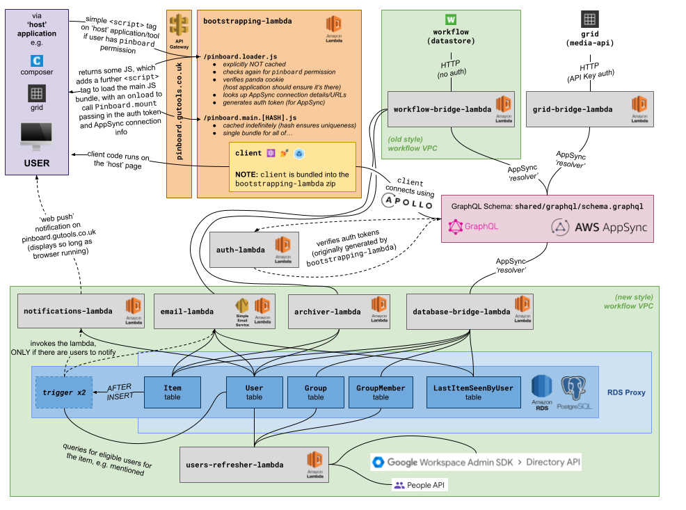

# PinBoard 📌

```
A Guardian discussion and asset sharing app for editorial story development, integrated with our key editorial tools such as Composer (news stories) and the Grid (images).
```

This project is written pretty much exclusively in TypeScript (both frontend & backend) and is entirely serverless (server side is a set of lambdas plus [AWS AppSync](https://aws.amazon.com/appsync/)) except the database which is an RDS Postgres instance.

We use [yarn workspaces](https://classic.yarnpkg.com/en/docs/workspaces/) to break up the project into different sub-projects...

- [`bootstrapping-lambda`](bootstrapping-lambda)
- [`client`](client)
- [`auth-lambda`](auth-lambda)
- [`notifications-lambda`](notifications-lambda)
- [`users-refresher-lambda`](users-refresher-lambda)
- [`workflow-bridge-lambda`](workflow-bridge-lambda)
- [`database-bridge-lambda`](database-bridge-lambda)
- [`grid-bridge-lambda`](grid-bridge-lambda)
- [`archiver-lambda`](archiver-lambda)
- [`email-lambda`](email-lambda)
- [`cdk`](cdk)

... PLUS a [`shared`](shared) directory for sharing constants and logic between the other sub-projects.

There's also a shared top level `tsconfig.json` (which is then [extended](https://www.typescriptlang.org/tsconfig#extends) in the sub-project, e.g. to configure react in the `client` sub-project).

To avoid the burden of maintaining lots of dependencies across all the different tools, PinBoard takes a different approach, where we add a `<script` tag to the various tools ([e.g. in composer](https://github.com/guardian/flexible-content/blame/f9d37a49b0690a67952d2ccccf5255ab3dd7a3a6/flexible-content-composer-backend/src/main/webapp/WEB-INF/scalate-admin/composer.ssp#L106-L108)), which hits the [`bootstrapping-lambda`](bootstrapping-lambda) on the `/pinboard.loader.js` endpoint (which is explicitly NOT cached) which performs some auth checks before returning some javascript code - this approach facilitates super-fast deploys (when compared to a browser extension or releasing libraries then having to release all the host platforms with library bump).

**To see how all this fits together see the [Architecture Diagram](#architecture-diagram).**

## Running locally

### First-time set-up

Run `./scripts/setup.sh`, which...

- configures dev-nginx (according to `dev-nginx.yaml`)
- ensures all dependencies are installed

### Each time

- Ensure you have the latest AWS credentials (profile: `workflow`)
- Run `./scripts/start.sh`
- To check it's up, hit https://pinboard.local.dev-gutools.co.uk (to see the PinBoard floaty etc. on a blank page - having gone through the auth and permission checks - if you don't see anything take a look at the console in the browser)
- If the page doesn't seem to be working, and there is a [panda](https://github.com/guardian/pan-domain-authentication)-related error in the console, you may need to run and open another tool locally (like [Composer](https://github.com/guardian/flexible-content)) in order to generate the required auth cookies

NOTE: locally it uses the CODE AppSync API instance (since AppSync is a paid feature of localstack)

## Architecture Diagram

 https://docs.google.com/drawings/d/19ckVsYpa4nEzSHxJTcB5_4yiXNztIngZdMUZLqb2HIM/edit

## Architecture Decision Records (ADRs)

ADRs can be found in [`ADRs` directory](./ADRs), worth highlighting...

- [`database`](./ADRs/database.md)

## Updating the GraphQL schema

After making any changes to `shared/graphql/schema.graphql`, run `yarn graphql-refresh` in the root of the project. This will regenerate `shared/graphql/graphql.ts`, which contains the TypeScript type and resolver definitions to match the GraphQL schema. We use [GraphQL Code Generator](https://graphql-code-generator.com/) to generate these definitions and this is configured in `graphql-refresh.yml`.

This generation step is run for you as part of the `setup.sh`, `start.sh` and `ci.sh` scripts.

Note, `shared/graphql/schema.graphql` is also used in CDK to form part of the Cloudformation.

### Testing queries/mutations from AppSync area of AWS Console (in the browser)

Occasionally you may want to test the GraphQL queries/mutations directly from the AWS Console. You for which you will need an auth token, you can generate these by running `yarn generate-appsync-auth-token` in the root of the project and selecting CODE or PROD from the prompt.

## Maintenance Tasks

- [managing the email groups in the messaging UI](./users-refresher-lambda/README.md#managing-email-groups)

## Connecting to the Database

When debugging, you might need to connect to the CODE or PROD database – you can do this by running the database-setup package.json script. That script starts an EC2 instance to use as a jump host: an SSH tunnel will be opened to the database via that instance. (It used to be possible to run the script by running `yarn database-setup`, but that doesn’t seem to work anymore, so this example uses npx and inlines the definition of that script.)

``` sh
> npx ts-node-dev shared/database/local/runDatabaseSetup.ts
[INFO] 16:58:30 ts-node-dev ver. 2.0.0 (using ts-node ver. 10.9.2, typescript ver. 5.8.2)
✔ Stage? › CODE
DB Proxy Hostname: pinboard-database-proxy-code.proxy-cg86nsstvc9z.eu-west-1.rds.amazonaws.com
Requesting a database 'jump host' (by ensuring desired count of the ASG is 1)
Waiting for instance to be 'running'...
Instance i-0712cec9ef4bf0553 is running 🎉
Waiting for instance to have 'OK' status...
```

Once the instance is ready (which can take a few minutes), the script creates an SSH tunnel. It then sets up an IAM token database login, and prints out the token before it prompts you with some database admin options.

``` sh
Instance i-0712cec9ef4bf0553 has OK status 🎉
Fetching SSH details...
SSH details fetched, establishing SSH tunnel...
SSH tunnel established on localhost:5432 🎉

IAM Token to use as DB password (if you want to connect from command line, IntelliJ etc.)
<TOKEN REDACTED>

Created new database connection pool
? Which setup step? › - Use arrow-keys. Return to submit.
❯   ALL
    create Item table
    create Item table index
    create LastItemSeenByUser table
    create LastItemSeenByUser table index
    create User table
    enable Lambda invocation from within RDS DB
    create/update 'after insert' trigger on Item table (to invoke notifications-lambda if applicable)
    add googleID column to User table
  ↓ create Group table
```

If you only want to connect to the database, you won’t want to run any of these options, so interrupt the command with ctrl-c and then use the token in your own command. Here’s an example `psql` call, where you need to have set up the password [in a pgpass file](https://www.postgresql.org/docs/current/libpq-pgpass.html) (note that the colon in the password will have to be backslash-escaped):

``` sh
> psql --host localhost --port 5432 --username pinboard --dbname pinboard
psql (14.23 (Homebrew), server 17.9)
WARNING: psql major version 14, server major version 17.
         Some psql features might not work.
SSL connection (protocol: TLSv1.3, cipher: TLS_AES_128_GCM_SHA256, bits: 128, compression: off)
Type "help" for help.

pinboard=> 
```

You don’t need to clean up the EC2 instance: it gets automatically spun down after a period of inactivity. Do make sure to kill the tunnel from your machine once you’re done with it, though.
