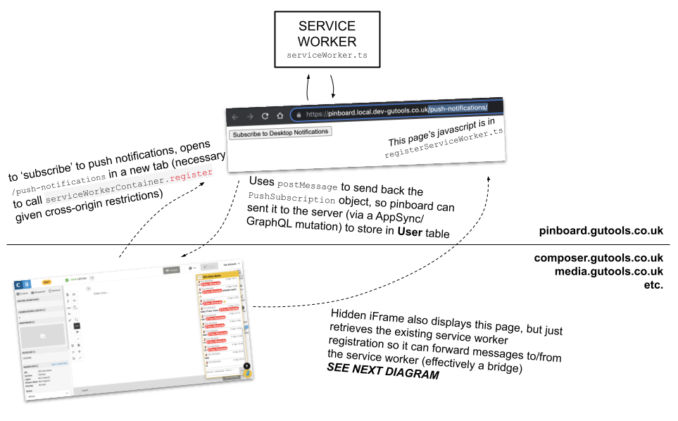
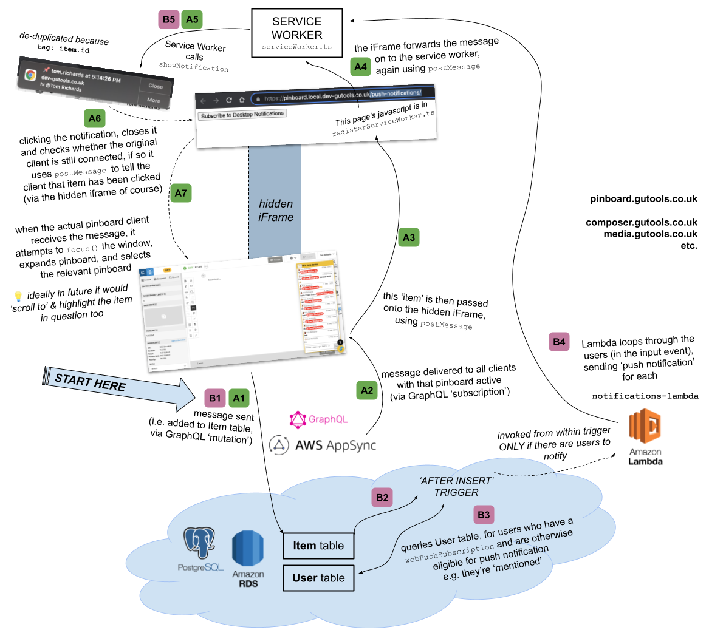

## `notifications-lambda`

This lambda is responsible for sending 'web push' notifications to users, this lambda makes use of the [web-push](https://www.npmjs.com/package/web-push) library and loads the private VAPID key from AWS Param Store.

Since https://github.com/guardian/pinboard/pull/161 this lambda is very simple, as it receives the item and users information directly in its input payload (from DB trigger, see second diagram) and so is simply firing out the 'web push' notifications. It makes most sense to explain here though how 'desktop notifications' work overall though, which is best done with the following diagrams...

 https://docs.google.com/drawings/d/14GGykKg_GsssXLO9vcL08z_b4IQ0QzPkQ-nVNDfnaDU/edit
 
 
 https://docs.google.com/drawings/d/17--IeZ5GCUeWkPuDnfV_3anyk9g0CwwbZoJ6Q4w_M8I/edit
